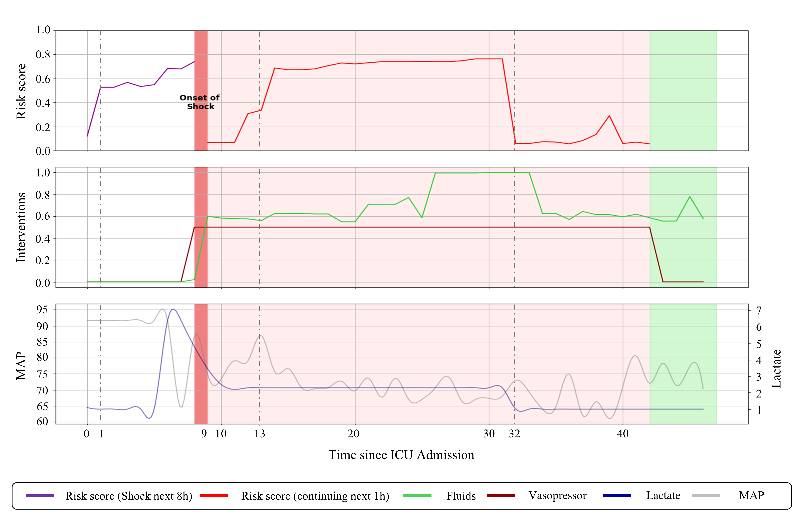
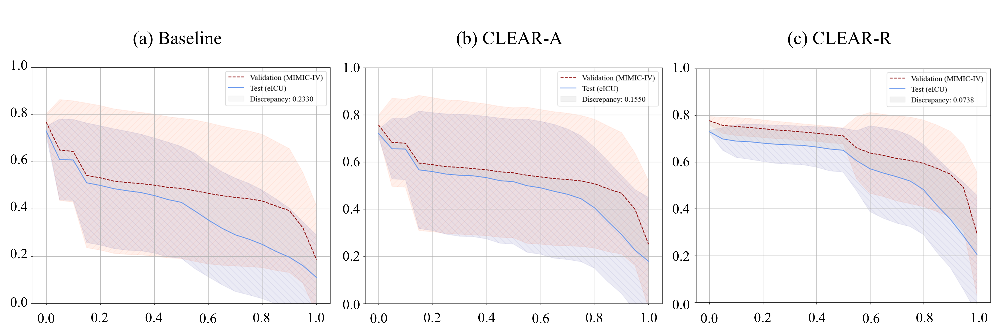

<div align="center">
  <h2><b>CLEAR-Shock: Contrastive LEARning for Shock  </b></h2>
</div>

<div align="center">

</div>

<div align="center">

**[<a href="https://ieeexplore.ieee.org/document/10834563">Paper Page</a>]**


</div>

<p align="center">

</p>

---
>
> 🙋 Please let us know if you find out a mistake or have any suggestions!
> 
> 🌟 If you find this resource helpful, please consider to star this repository and cite our research:


## Introduction
Shock is a life-threatening condition characterized by generalized circulatory failure, which can have devastating consequences if not promptly treated. Thus, early prediction and continuous monitoring of physiological signs are essential for timely intervention. While previous machine learning research in clinical settings has primarily focused on predicting the onset of deteriorating events, the importance of monitoring the ongoing state of a patient's condition post-onset has often been overlooked. In this study, we introduce a novel analytical framework for a prognostic monitoring system that offers hourly predictions of shock occurrence within the next 8 hours preceding its onset, along with forecasts regarding the likelihood of shock continuation within the subsequent hour post-shock occurrence. We categorize the patient's physiological states into four cases: pre-shock (non-shock or shock within the next 8 hours) and post-shock onset (continuation or improvement of shock within the next hour). To effectively predict these cases, we adopt supervised contrastive learning, enabling differential representation in latent space for training a predictive model. Additionally, to extract effective contrastive embeddings, we incorporate a feature tokenizer transformer into our approach. Our framework demonstrates improved predictive performance compared to baseline models when utilizing contrastive embeddings, validated through both internal and external datasets. Clinically, our system significantly improved early detection by identifying shock on average 6 hours before its onset. This framework not only provides early predictions of shock likelihood but also offers real-time assessments of shock persistence risk, thereby facilitating early prevention and evaluation of treatment effectiveness.


<p align="center">

</p>

The schematic diagram illustrates how the prognostic monitoring system works. The first row illustrates the evolution of early prediction scores over time, distinguished before and after shock occurrence. The red shaded area represents shock state and the green shaded area denotes full recovery from shock. The second row displays administration changes in two interventions (fluids and vasopressors) over time. Fluids are scaled between 0 and 1 for the administered amount, while vasopressors are scaled to 0.5 if administered and 0 if not. The third row shows changes in MAP and lactate over time, with trends smoothed for easier identification.

## Results  

Model Performance on Validation and Test Sets.  

| Model    | Set   | Case 1 AUROC ± Std | Case 1 AUPRC ± Std | Case 2 AUROC ± Std | Case 2 AUPRC ± Std | Case 3 AUROC ± Std | Case 3 AUPRC ± Std | Case 4 AUROC ± Std | Case 4 AUPRC ± Std |
| -------- | ----- | ------------------ | ------------------ | ------------------ | ------------------ | ------------------ | ------------------ | ------------------ | ------------------ |
| Baseline | Valid | 0.881 ± 0.104      | 0.915 ± 0.058      | 0.763 ± 0.069      | 0.704 ± 0.055      | 0.838 ± 0.102      | 0.824 ± 0.093      | 0.836 ± 0.108      | 0.744 ± 0.181      |
|          | Test  | 0.713 ± 0.124      | 0.821 ± 0.082      | 0.631 ± 0.071      | 0.424 ± 0.098      | 0.705 ± 0.121      | 0.569 ± 0.187      | 0.746 ± 0.153      | 0.747 ± 0.162      |
| CLEAR-A  | Valid | 0.883 ± 0.102      | 0.918 ± 0.056      | 0.771 ± 0.071      | 0.705 ± 0.052      | 0.845 ± 0.100      | 0.838 ± 0.089      | 0.851 ± 0.107      | 0.760 ± 0.180      |
|          | Test  | 0.710 ± 0.116      | 0.830 ± 0.070      | 0.673 ± 0.076      | 0.487 ± 0.093      | 0.717 ± 0.124      | 0.555 ± 0.204      | 0.802 ± 0.140      | 0.773 ± 0.170      |
| CLEAR-R  | Valid | **0.926 ± 0.041**  | **0.938 ± 0.032**  | **0.794 ± 0.039**  | **0.716 ± 0.051**  | **0.889 ± 0.040**  | **0.867 ± 0.051**  | **0.882 ± 0.069**  | **0.839 ± 0.068**  |
|          | Test  | **0.743 ± 0.100**  | **0.840 ± 0.067**  | **0.701 ± 0.051**  | **0.511 ± 0.054**  | **0.766 ± 0.087**  | **0.596 ± 0.164**  | **0.846 ± 0.104**  | **0.841 ± 0.100**  |


<p align="center">

</p>


## Requirements
Use python 3.9 from Anaconda

- torch==1.12.1
- pytorch-losses==0.0.1
- einops==0.7.0
- matplotlib==3.8.2
- numpy==1.26.3
- pandas==2.0.3
- scikit-learn==1.3.0
- scipy==1.10.1
- tqdm==4.65.0
- lightgbm==4.3.0
- xgboost==1.7.6
- wandb==0.16.3


To install all dependencies:
```
pip install -r requirements.txt
```

## Datasets
You can access the MIMIC-IV from [[MIMIC-IV]](https://physionet.org/content/mimiciv/2.2/) and eICU-CRD from [[eICU-CRD]](https://physionet.org/content/eicu-crd/2.0/)

## Quick Demos
1. Download datasets  
2. Make derived variables through Derived_Variable.py (Lactate Clearance, Cumulative sum of vasopressor use amount, Percentage change in measurement.).
3. Annotation, Labeling, Preprocessing for analysis is available through Case.py.  
4. The final preprocessed datasets are saved in csv format through main_case.py.  

## Training  
1. main.py: Training(Optuna), Get Embedding, Get Feature Importance from Self Attention map.  
2. main.sh: Script that can run the above three modes.  

## Experiment  

This part includes case predicion, and monitoring system visualization, as shown in the Discussion section.  
- Baseline.py: Baseline experiment(Internal(or External) validation(classification performance, Naive system accuracy, Avergaed cosine index)).  
- CLEAR.py: Proposed method experiment(Internal(or External) validation(classification performance, Naive system accuracy, Avergaed cosine index)), Prognositc Monitoring system working process visualization.


## Citations  

if you found this repo useful, please consider citing our paper:  

```bibtex
  @article{kwon2025clear,
    title={CLEAR-Shock: Contrastive LEARning for Shock},
    author={Kwon, Jeong Eul and Lee, Sung Woo and Kim, Su Jin and Han, Kap Su and Lee, Sijin and Song, Juhyun and Lee, Hyo Kyung},
    journal={IEEE Journal of Biomedical and Health Informatics},
    year={2025},
    publisher={IEEE}
  }
```
